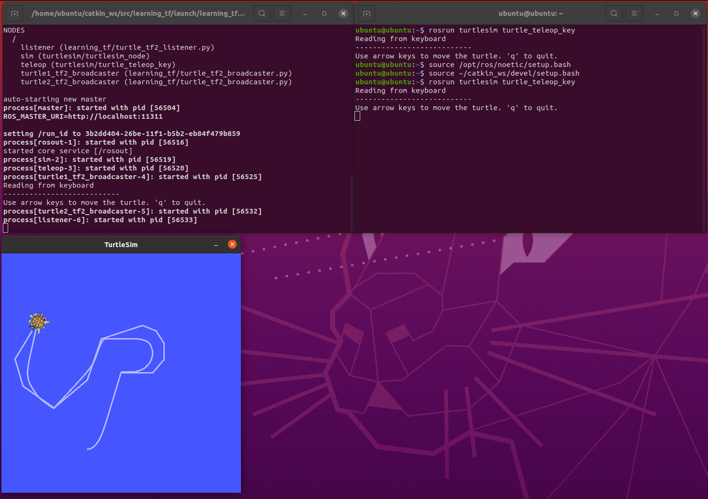
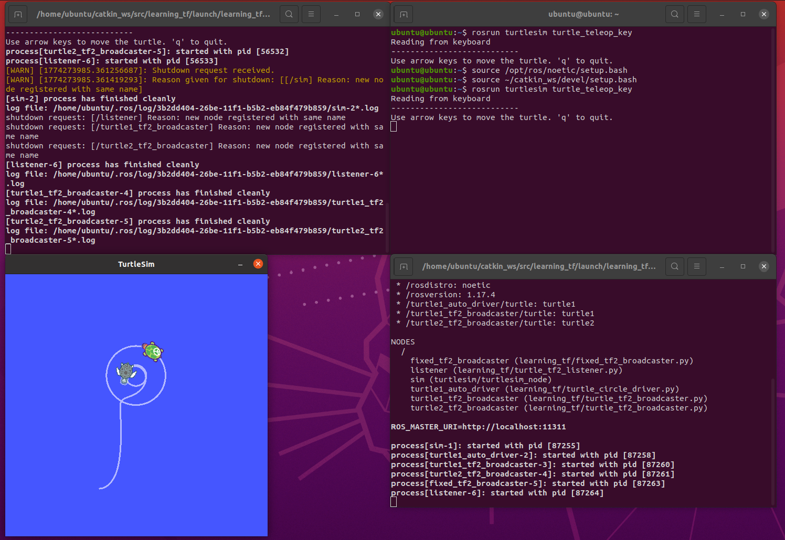
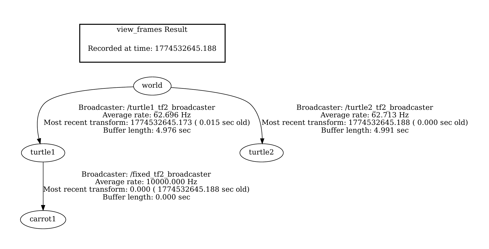
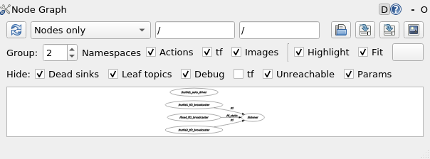
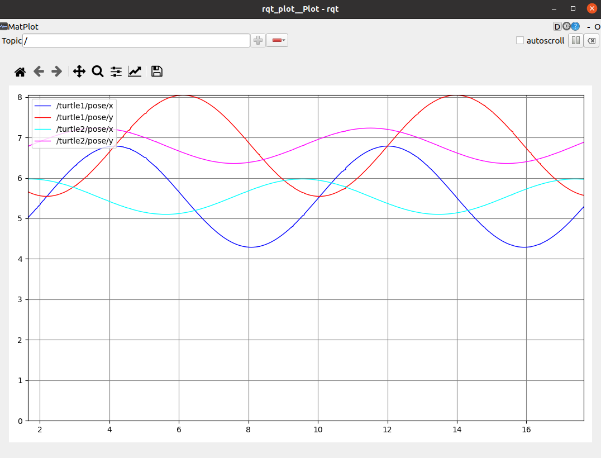
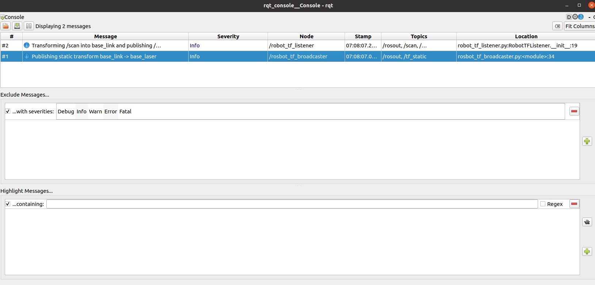
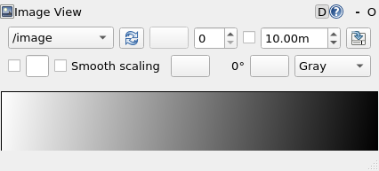
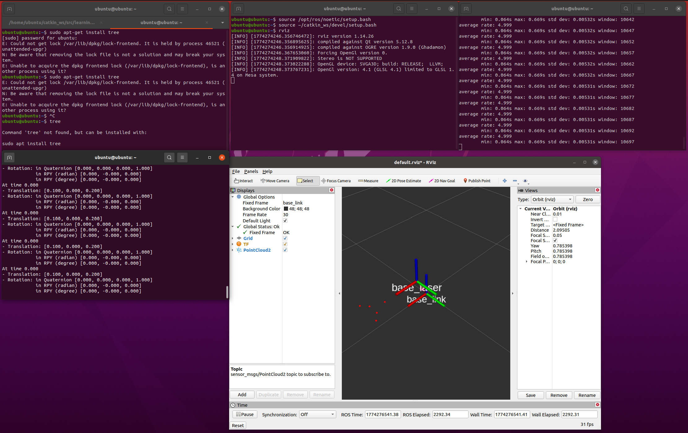

# CS401 Intelligent Robotics Lab 03 Report

Date: 2026-03-26

## 1. Objectives

This lab focuses on the ROS tf/tf2 mechanism and related visualization tools. The required tasks are:

1. Complete the tf2 tutorials based on the LAB3 materials.
2. Reproduce the turtlesim tf2 demo and verify the frame relationships.
3. Implement a `learning_tf` package that publishes the `base_link -> base_laser` transform and converts laser data from the `base_laser` frame into the `base_link` frame.
4. Verify the results with command-line tools and RViz.
5. Practice the QT Toolkit tools, including `rqt_graph`, `rqt_plot`, `rqt_console`, and `rqt_image_view`.

## 2. Environment

- Remote host: `ubuntu@192.168.44.132`
- Operating system: Ubuntu 20.04.6 LTS
- ROS version: ROS Noetic 1.17.4
- Workspace: `~/catkin_ws`
- Package delivered in this lab: `learning_tf`

The remote machine did not provide a physical USB camera device (`/dev/video*` was absent), so the camera visualization part was completed by publishing a static image topic with `image_publisher` and viewing it in `rqt_image_view`.

## 3. Implementation Summary

### 3.1 tf2 tutorial package

A package named `learning_tf` was created in `~/catkin_ws/src`. The package contains:

- `turtle_tf2_broadcaster.py`
- `turtle_tf2_listener.py`
- `fixed_tf2_broadcaster.py`
- `dynamic_tf2_broadcaster.py`
- `turtle_tf2_message_broadcaster.py`
- `turtle_circle_driver.py`
- `learning_tf_py.launch`

The tutorial package reproduces the main tf2 workflow in LAB3:

- broadcasting transforms from turtle poses
- listening to transforms and driving `turtle2`
- adding an extra fixed frame `carrot1`
- adding a dynamic frame for extended tf2 practice

### 3.2 Laser frame transformation task

According to the LAB3 PDF, the laser center is offset from the robot base center by:

- `x = 0.1 m`
- `y = 0.0 m`
- `z = 0.2 m`

To complete the task, two custom nodes were implemented:

- `rosbot_tf_broadcaster.py`
- `robot_tf_listener.py`

`rosbot_tf_broadcaster.py` publishes a static transform from `base_link` to `base_laser`.

`robot_tf_listener.py` subscribes to `LaserScan`, projects it into `PointCloud2`, and transforms the result into the `base_link` frame.

In ROS Noetic Python, `laser_geometry` does not directly expose `transformLaserScanToPointCloud(...)`. Therefore the implementation uses:

- `LaserProjection.projectLaser(...)`
- `tf2_sensor_msgs.do_transform_cloud(...)`

This achieves the same frame conversion required by the experiment.

### 3.3 QT Toolkit and image visualization

The QT Toolkit part of LAB3 was completed with the following ROS GUI tools:

- `rqt_graph` for node and topic graph visualization
- `rqt_plot` for observing numeric topic changes
- `rqt_console` for ROS log inspection
- `rqt_image_view` for image topic visualization

Because there was no physical USB camera on the remote machine, `image_publisher` was used to publish a static image as the `/image` topic. This provided a practical replacement for the camera visualization step while keeping the ROS image-processing workflow unchanged.

## 4. Main Files and Structure

The final package structure is:

- `include/learning_tf/`
- `launch/learning_tf_py.launch`
- `launch/rosbot_tf.launch`
- `scripts/*.py`
- `src/`
- `package.xml`
- `CMakeLists.txt`

The generated package zip is `learning_tf.zip`.

## 5. Experimental Procedure

### 5.1 Build the workspace

```bash
cd ~/catkin_ws
catkin_make
source /opt/ros/noetic/setup.bash
source ~/catkin_ws/devel/setup.bash
```

### 5.2 Run the tf2 turtlesim demo

```bash
roslaunch learning_tf learning_tf_py.launch
rosrun turtlesim turtle_teleop_key
```

Useful verification commands:

```bash
rosrun tf view_frames
rosrun rqt_tf_tree rqt_tf_tree
rosrun tf tf_echo turtle1 turtle2
rviz -d /opt/ros/noetic/share/turtle_tf2/rviz/turtle_rviz.rviz
```

### 5.3 Run the additional fixed frame demo

```bash
roslaunch learning_tf learning_tf_py.launch use_teleop:=false auto_drive_turtle1:=true use_fixed_frame:=true follow_frame:=carrot1
rosrun tf tf_echo turtle1 carrot1
```

### 5.4 Run the laser scan transformation demo

```bash
roslaunch learning_tf rosbot_tf.launch
```

Useful verification commands:

```bash
rosrun tf tf_echo base_link base_laser
rostopic echo -n 1 /scan_in_base_link/header
rostopic hz /scan_in_base_link
rviz
```

Recommended RViz settings:

- Fixed Frame: `base_link`
- Add `TF`
- Add `PointCloud2`
- Topic: `/scan_in_base_link`

### 5.5 Run the QT Toolkit and image visualization demo

For the turtlesim tf2 demo:

```bash
roslaunch learning_tf learning_tf_py.launch use_teleop:=false auto_drive_turtle1:=true use_fixed_frame:=true follow_frame:=carrot1
rqt_graph
rqt_plot /turtle1/pose/x /turtle1/pose/y /turtle2/pose/x /turtle2/pose/y
rosrun tf view_frames
```

For the laser transform demo:

```bash
roslaunch learning_tf rosbot_tf.launch
rqt_console
```

For the image topic visualization:

```bash
rosrun image_publisher image_publisher ~/lab3_camera_input.png
rqt_image_view
```

## 6. Results

### 6.1 tf2 tutorial verification

The turtlesim demo started correctly and the following nodes were observed:

```text
/listener
/rosout
/turtle1_auto_driver
/turtle1_tf2_broadcaster
/turtle2_tf2_broadcaster
/turtlesim
```

The transform between `turtle1` and `turtle2` was successfully queried:

```text
At time 1774273038.609
- Translation: [-0.682, 0.933, 0.000]
- Rotation: in Quaternion [0.000, 0.000, -0.539, 0.842]
```

Pose sampling also confirmed that `turtle2` moved while following the target frame:

```text
turtle1 (6.27, 5.26, -2.869) -> (5.439, 3.633, -1.23)
turtle2 (7.161, 4.537, 2.283) -> (6.104, 4.578, -2.373)
```



### 6.2 Extra frame and TF tree verification

The fixed frame `carrot1` was added successfully:

```text
At time 0.000
- Translation: [0.000, 2.000, 0.000]
- Rotation: in Quaternion [0.000, 0.000, 0.000, 1.000]
```

This matches the expected fixed offset relative to `turtle1`.

The `view_frames` result clearly showed the frame hierarchy `world -> turtle1 -> carrot1` and `world -> turtle2`, which is much easier to inspect than pairwise `tf_echo` output when multiple frame IDs are involved.





### 6.3 QT Toolkit and image visualization verification

The QT Toolkit section was reproduced on the remote machine as follows:

- `rqt_graph` successfully displayed the ROS computation graph of the turtlesim tf2 demo.
- `rqt_plot` was launched with `/turtle1/pose/x`, `/turtle1/pose/y`, `/turtle2/pose/x`, and `/turtle2/pose/y` to monitor changing pose values during the demo, and the curves changed continuously while the turtles moved.
- `rqt_console` was launched during the laser transform experiment to inspect ROS logs, and the expected `Info` messages from the broadcaster and listener were displayed.
- `rqt_image_view` successfully subscribed to `/image`, which was published by `image_publisher`.

Representative GUI captures are shown below:









During the same `rosbot_tf.launch` run, the terminal logs confirmed that the relevant ROS messages were being produced:

```text
[INFO] Transforming /scan into base_link and publishing /scan_in_base_link
[INFO] Publishing static transform base_link -> base_laser
```

Because the current Ubuntu environment had no physical USB camera and no `/dev/video*` device, a static image topic was used instead of `usb_cam`. This substitution was sufficient to complete the QT Toolkit and image visualization workflow required by the lab.

### 6.4 Laser transformation verification

The static transform between `base_link` and `base_laser` was successfully published:

```text
At time 0.000
- Translation: [0.100, 0.000, 0.200]
- Rotation: in Quaternion [0.000, 0.000, 0.000, 1.000]
```

The transformed point cloud header confirmed the target frame:

```text
seq: 1
frame_id: "base_link"
```

The transformed point cloud topic was published stably at approximately 5 Hz:

```text
average rate: 4.994
average rate: 5.004
average rate: 5.000
```

A sample of transformed points is shown below:

```text
frame_id base_link
point_count 5
points [[0.541, -0.089, 0.2], [0.498, -0.04, 0.2], [0.4, 0.0, 0.2], [0.498, 0.04, 0.2], [0.541, 0.089, 0.2]]
```

The center point `(0.4, 0.0, 0.2)` is consistent with the LAB3 geometry: a point located `0.3 m` ahead of `base_laser` appears `0.4 m` ahead of `base_link` after adding the `0.1 m` frame offset.

The GUI verification also showed the transformed point cloud in RViz with `base_link` as the fixed frame, while `tf_echo` continuously reported the expected static transform and `rostopic hz` confirmed a stable publication rate.



## 7. Discussion

This experiment demonstrates the core usage pattern of tf2 in ROS:

- use broadcasters to publish frame relationships
- use listeners and tf buffers to query transforms
- combine frame conversion with sensor data processing
- combine GUI tools with command-line tools for verification when the number of frames or topics becomes large

The laser transformation part is a direct example of how tf2 connects a sensor frame to a robot base frame, which is a common requirement in mobile robotics and navigation.

The QT Toolkit part complements the tf2 work by providing a faster way to inspect graphs, image topics, and experiment status in GUI form.

## 8. Conclusion

The main LAB3 tasks were completed successfully on the remote Ubuntu machine:

1. The tf2 turtlesim tutorial was reproduced successfully.
2. The frame relationships were verified with `tf_echo`, `view_frames`, and RViz.
3. The `learning_tf` package was implemented and built successfully.
4. Laser data from `base_laser` was transformed into the `base_link` frame correctly.
5. The QT Toolkit and camera visualization requirement was completed with `rqt_graph`, `rqt_plot`, `rqt_console`, and `rqt_image_view`, using a static image topic as a substitute for a physical USB camera.

## 9. Submission Contents

The final submission package contains:

- `LAB3_report.pdf`
- `learning_tf.zip`
- `submission_manifest.txt`
